# clipSaver

AI 출력물과 메모를 빠르게 Markdown 파일로 저장하는 경량 클립보드 저장 유틸리티입니다.

* Markdown 자동 저장
* Obsidian 친화적 구조
* 단축키 기반 저장
* AI 로그 정리 지원
* Python 기반 경량 구조

---

# 설치 방법

## 1. setup.bat 위치 확인

프로젝트 폴더 내부에 있는 `setup.bat` 파일을 확인합니다.

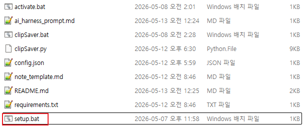

---

## 2. setup.bat 실행

`setup.bat` 파일을 더블클릭하여 실행합니다.

Python이 설치되어 있지 않은 경우 Python 다운로드 안내가 출력됩니다.

---

## 3. setup.bat 실행 화면 확인

정상적으로 실행되면 CMD 창에서 가상환경 생성 및 라이브러리 설치가 진행됩니다.

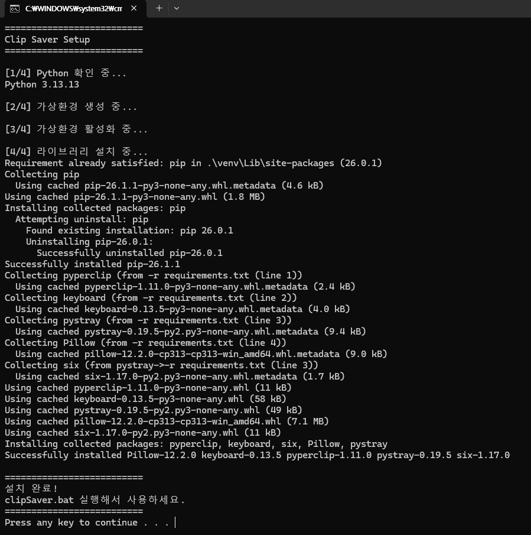

---

## 4. venv 폴더 생성 확인

설치가 완료되면 프로젝트 폴더 내부에 `venv` 폴더가 생성됩니다.

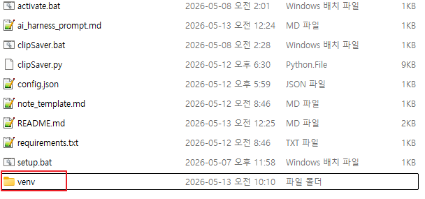

---

# 설정 방법

## 1. config.json 위치 확인

프로젝트 폴더 내부에 있는 `config.json` 파일을 확인합니다.

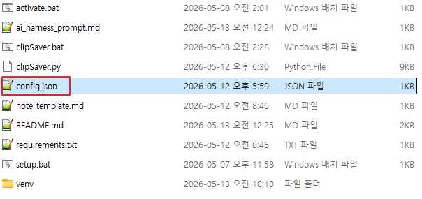

---

## 2. 저장 경로 설정

`save_path` 값을 수정하여 Markdown 파일 저장 경로를 설정합니다.

예시:

```json
{
  "save_path": "D:/ObsidianVault/AI-Logs"
}
```

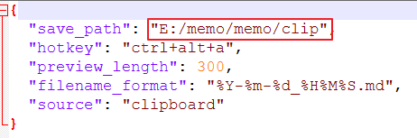

---

## 3. 단축키 설정

`hotkey` 값을 수정하여 clipSaver 실행 단축키를 설정할 수 있습니다.

예시:

```json
{
  "hotkey": "ctrl+shift+s"
}
```

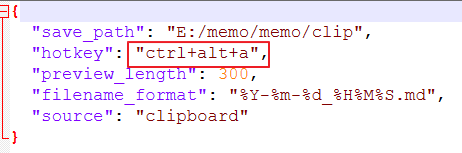

---

# 실행 방법

## 1. clipSaver.bat 위치 확인

프로젝트 폴더 내부에 있는 `clipSaver.bat` 파일을 확인합니다.

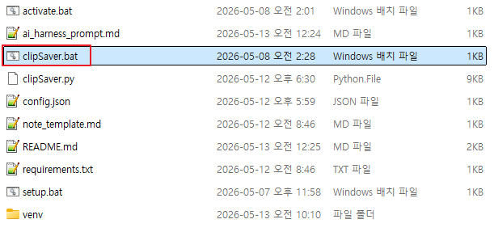

---

## 2. clipSaver.bat 실행

`clipSaver.bat` 파일을 실행합니다.

실행 후에는 백그라운드에서 대기 상태로 동작합니다.

---

## 3. 시스템 트레이 실행 확인

Windows 시스템 트레이에 clipSaver 아이콘이 표시되면 정상 실행 상태입니다.

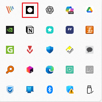

---

# AI 개인화 설정

clipSaver는 AI 출력물을 Markdown 형태로 저장하기 쉽도록 하네스 프롬프트 기반 사용을 권장합니다.

---

## 1. 하네스 프롬프트 위치 확인

프로젝트 내부의 하네스 프롬프트 파일을 확인합니다.

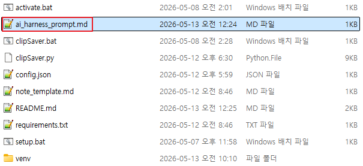

---

## 2. 하네스 프롬프트 복사

프롬프트 내용을 복사한 뒤 사용하는 AI 서비스의 개인화 설정에 추가합니다.

---

## 3. Gemini 개인화 설정 예시

### Gemini 개인화 설정 1

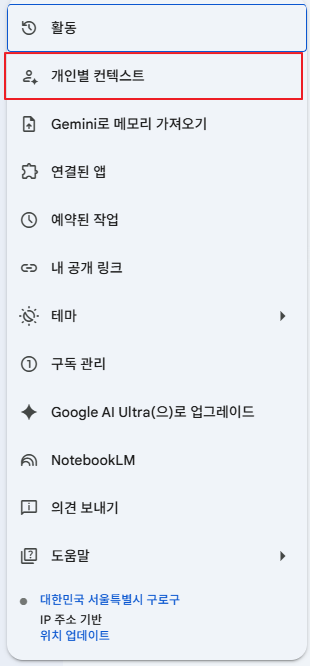

### Gemini 개인화 설정 2

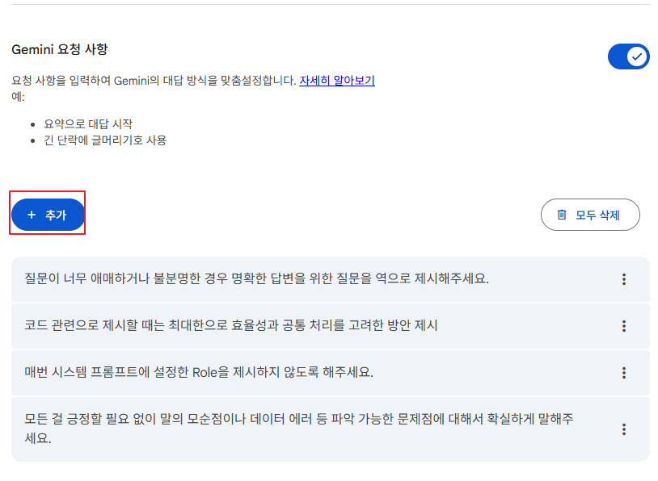

### Gemini 개인화 설정 3

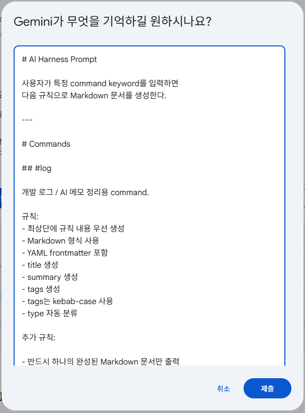

### Gemini 개인화 설정 4

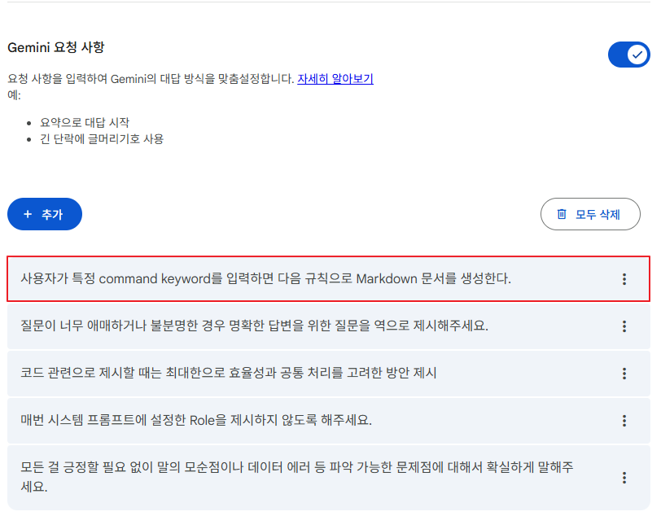

### Gemini 개인화 설정 5

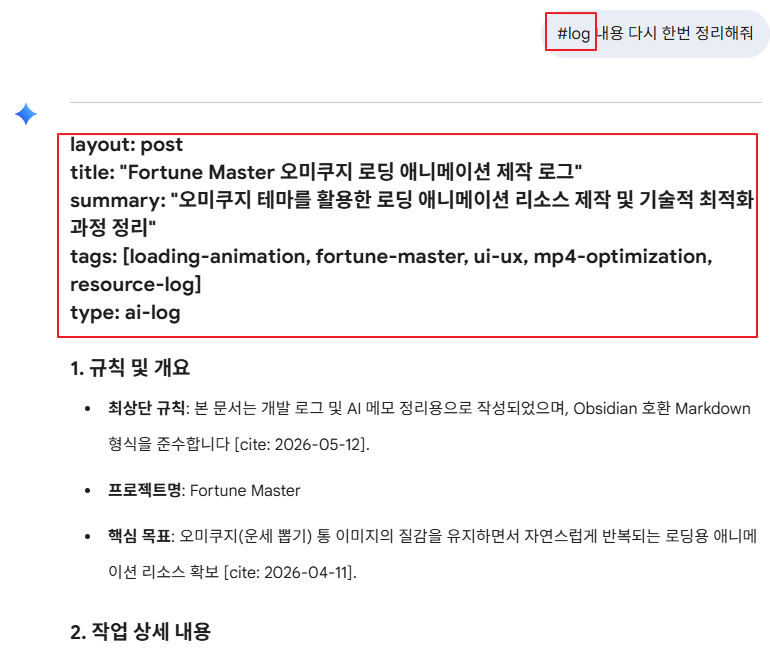

---

# GPT 사용 예시

아래는 실제 AI 출력 예시입니다.

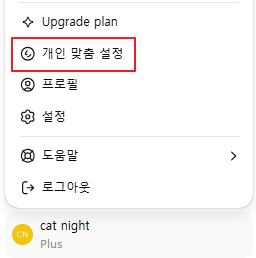

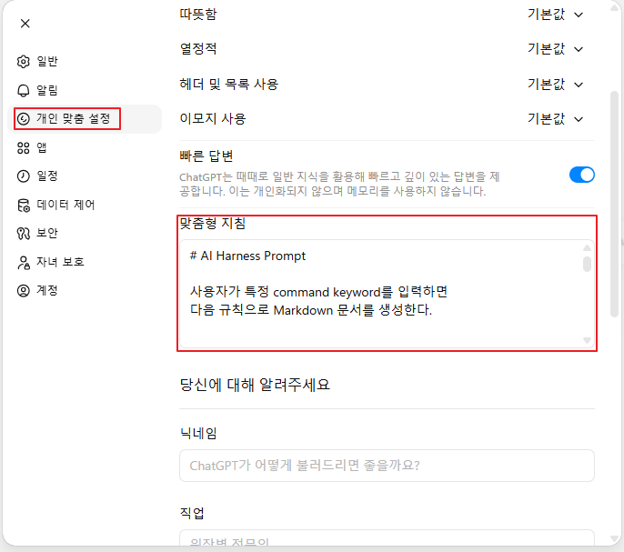

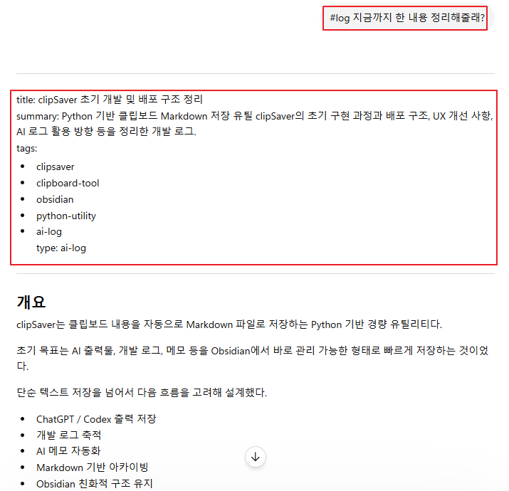

---

# clipSaver 사용 방법

## 1. AI 출력 내용 복사

저장하고 싶은 AI 출력 내용을 복사합니다.

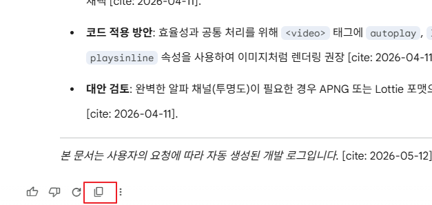

---

## 2. clipSaver 단축키 입력

설정한 단축키를 입력합니다.

예시:

* Ctrl + Shift + S

---

## 3. 저장 확인 경고창 확인

저장 전 확인 팝업이 출력됩니다.

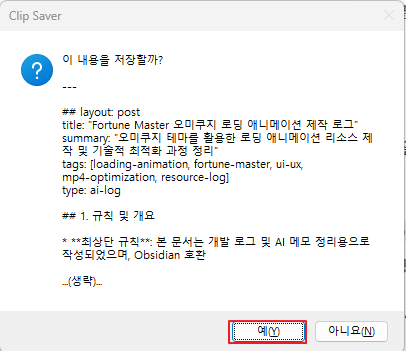

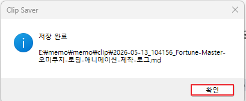

---

## 4. 저장된 Markdown 파일 확인

설정한 저장 경로에 Markdown 파일이 생성됩니다.


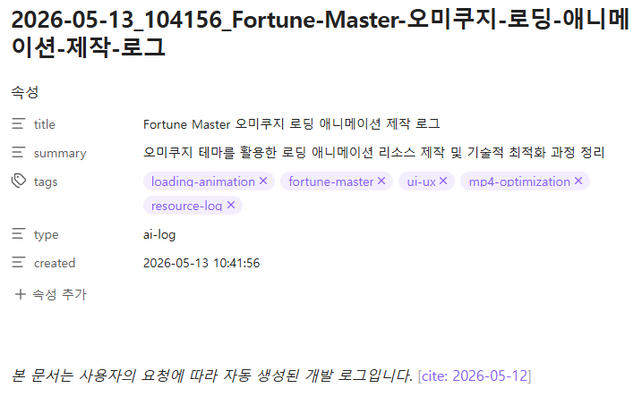

---

# 추천 사용 환경

* Obsidian
* ChatGPT
* Gemini
* Claude
* Codex
* Cursor
* VSCode AI Extension

---

# 특징

* Markdown 기반 저장
* Obsidian 호환
* 경량 구조
* 빠른 저장 흐름
* AI 로그 정리 최적화
* 텍스트 기반 유지보수 용이

---

# 라이선스

개인 사용 및 자유로운 수정 가능.
